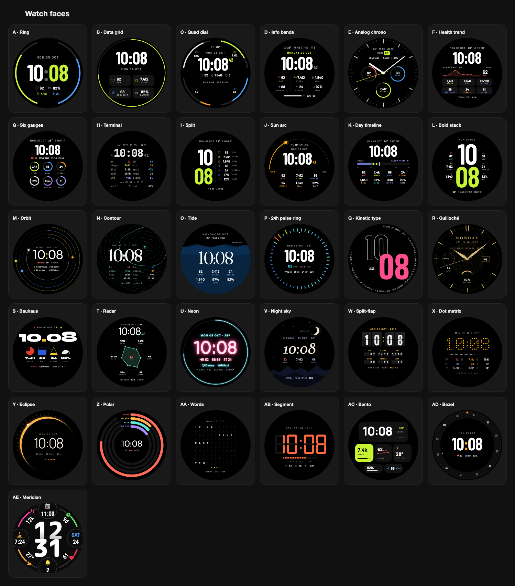

# Garmin watch faces

31 Connect IQ watch faces for round AMOLED Garmin watches (API 5.0+), designed on the
vívoactive 6 (390×390) and built for 49 devices — from Venu 2 and vívoactive 5 to fēnix 8,
Forerunner 970 and Venu 4. Every face has an active and an always-on (AOD) design.

**[▶ Browse all faces](https://naythukhant.github.io/Garmin/)** — every face, active and always-on, with
its color options and every setting it offers ([`faces.html`](faces.html), published by GitHub Pages).

[](https://naythukhant.github.io/Garmin/)

## Faces

| | | | |
|---|---|---|---|
| A · Ring | B · Data grid | C · Quad dial | D · Info bands |
| E · Analog chrono | F · Health trend | G · Six gauges | H · Terminal |
| I · Split | J · Sun arc | K · Day timeline | L · Bold stack |
| M · Orbit | N · Contour | O · Tide | P · 24h pulse ring |
| Q · Kinetic type | R · Guilloché | S · Bauhaus | T · Radar |
| U · Neon | V · Night sky | W · Split-flap | X · Dot matrix |
| Y · Eclipse | Z · Polar | AA · Words | AB · Segment |
| AC · Bento | AD · Bezel | **AE · Meridian** | |

**AE · Meridian** is fully customizable: 8 data fields (4 circles + 4 arc gauges) with 37 data
options, background themes, 4 time fonts, circle/hexagon frames, and colors — through the phone
settings, Garmin's native on-watch editor (vívoactive 6, Venu 4, fēnix 8, FR 570/970, …) or an
on-watch menu (vívoactive 5, Venu 2/3, FR 165/265/965, epix 2, …). Tapping a field opens the
related Garmin app.

## Install

**From a release** — download from [Releases](../../releases):

- `<Face>-vivoactive6.prg` / `<Face>-vivoactive5.prg` — sideload to a vívoactive 6 or 5: connect the watch by USB (watch
  *Settings → System → USB Mode* = **MTP**), open it with [OpenMTP](https://openmtp.ganeshrvel.com)
  on macOS, copy the file to `GARMIN/APPS/`, quit OpenMTP and unplug. Pick the face under
  *Settings → Watch Face*. Sideloaded faces don't get phone settings.
- `<Face>.iq` — the package for every supported device; upload it to the
  [Connect IQ Store](https://apps.garmin.com/developer/) (or as a private **beta**) and install from
  the Connect IQ app to get the phone settings.

Each CI run also keeps the `.iq` and the vívoactive 6 and 5 `.prg` per face as downloadable artifacts (Actions → run → Artifacts).

## Build locally

Requirements: Connect IQ SDK 9.2 and the device files (installed with Garmin's SDK Manager),
Java 17+, Python 3, and a signing key at `./developer_key` (never committed).

```sh
tools/build.sh MeridianFace          # build for the vívoactive 6 simulator (no args = all faces)
tools/run.sh MeridianFace            # build + run in the simulator (settings editor works)
tools/build_devices.sh MeridianFace  # build + fit-check every device in the manifest
tools/export.sh MeridianFace         # Store package -> dist/MeridianFace.iq
```

The scripts find the SDK in its macOS default location; set `CIQ_SDK` and `CIQ_DEVICES` to override
(see `tools/ciq_env.sh`).

Other tools:

| Tool | What it does |
|---|---|
| `tools/mkfont.py <Face>` | Turns the mockup's Google Fonts into bitmap fonts (`fonts.json`) for 360/390/416/454/466 px screens; also builds icon fonts from SVG sets in `tools/icons/`. Needs `tools/.venv` (Pillow, fontTools) and Chrome for icons. |
| `tools/make_icons.sh [Face]` | Launcher icon at each device's exact size from `icon.json`. |
| `tools/set_products.sh` | Writes `tools/devices.txt` (the 49 target devices) into every manifest. |
| `tools/build_gallery.py` | Regenerates `faces.html` from `mockups/`. |
| `tools/render_mockup.py` | Renders one mockup to PNG with headless Chrome. |
| `tools/render_preview.py` | Renders `docs/preview.png` (this README's image: every face's active design) from `faces.html`. |
| `tools/gen_meridian_settings.py` / `gen_meridian_mockup.py` / `check_meridian.py` | Meridian's generated settings, mockup and symmetry check. |

## CI and releases

`.github/workflows/build.yml` (GitHub Actions):

- Downloads SDK 9.2 and all devices once with
  [connect-iq-sdk-manager-cli](https://github.com/lindell/connect-iq-sdk-manager-cli) and caches them.
- Builds every face, checks every device, and uploads the `.iq` + vívoactive 6 and 5 `.prg` per face.
- Pushing a version tag publishes a GitHub Release with every `.iq`, `<Face>-vivoactive6.prg` and `<Face>-vivoactive5.prg`,
  keeping only the 3 newest releases:

  ```sh
  git tag v1.1 && git push origin v1.1
  ```

Repository settings it needs: secrets `GARMIN_USERNAME`, `GARMIN_PASSWORD`, `DEVELOPER_KEY_B64`
(`base64 -i developer_key`) and variable `CIQ_AGREEMENT_HASH`.

## Layout

```
faces/<Name>Face/   one Connect IQ project per face (manifest, source, resources, fonts.json, icon.json)
mockups/            HTML mockups of every face (active + always-on), the design source
faces.html          gallery of all mockups (generated)
tools/              build, font, icon, gallery and CI helper scripts; Google Fonts TTFs in tools/fonts
```

## Notes

- Always-on screens follow Garmin's AMOLED burn-in rules (≤10% lit pixels, no pixel lit for long):
  every face shifts slightly each minute and masks alternate pixel rows.
- Fonts in `tools/fonts/` are Google Fonts under the SIL Open Font License. The Garmin SDK and device
  files are not included (Garmin's license doesn't allow redistribution).
